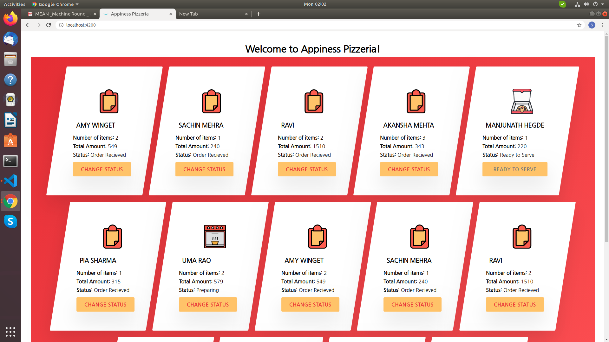
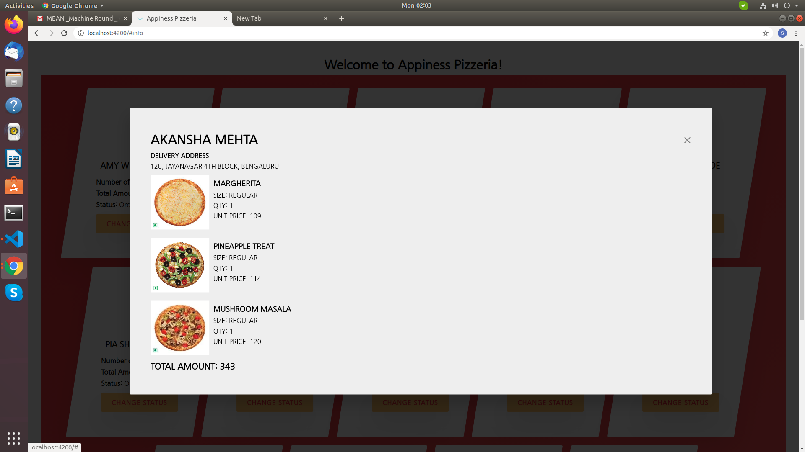

# Appiness Pizzeria
Appiness Pizzeria is for the angular task wherein the orders are listed and status of the order is changed on click.  
And by clicking on order, it shows the additional information

## Prerequisites

[Angular CLI](https://github.com/angular/angular-cli) version 7.3.10.  
And to download other dependencies, Run `npm install` in project folder.

## Development server

Run `ng serve` for a dev server. Navigate to `http://localhost:4200/`. The app will automatically reload if you change any of the source files.

## Build

Run `ng build` to build the project. The build artifacts will be stored in the `dist/` directory. Use the `--prod` flag for a production build.

## Screenshots

